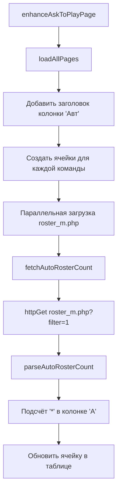
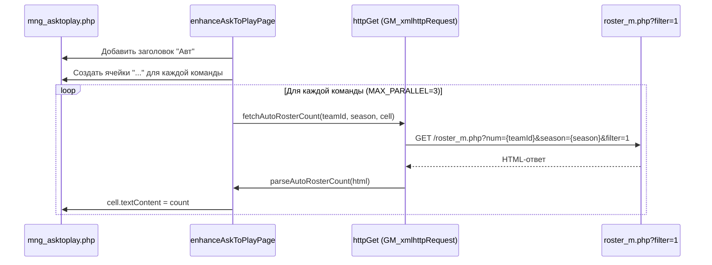

# Документ проектирования: auto-roster-count

## Обзор

Доработка Tampermonkey-скрипта calc.user.js: добавление на страницу `/mng_asktoplay.php` новой колонки «Авт» (автосоставы), показывающей количество матчей, в которых менеджер не отправил состав (автосостав). Для каждой команды загружается страница `roster_m.php?num={teamId}&season={currentSeason}&filter=1`, парсится колонка «А» и подсчитывается количество символов `*` — каждый `*` означает автосостав.

Функциональность встраивается в существующую функцию `enhanceAskToPlayPage()` по аналогии с колонкой «Школа»: добавляется заголовок, создаются ячейки для каждой строки команды, данные загружаются параллельно с ограничением `MAX_PARALLEL`.

## Архитектура



## Диаграмма последовательности



## Компоненты и интерфейсы

### Компонент 1: Определение текущего сезона

**Назначение**: Извлечь номер текущего сезона из страницы `mng_asktoplay.php`.

На странице присутствует форма `page_forma`, но сезон в ней не передаётся. Сезон можно извлечь из текста страницы (обычно отображается в заголовке или навигации) или из ссылок на `roster_m.php`, которые уже содержат параметр `season=`. Альтернативно — из любого элемента на странице, содержащего номер сезона.

**Интерфейс**:
```javascript
// Извлечение сезона из страницы
function getCurrentSeason() → string | null
```

### Компонент 2: Парсинг автосоставов

**Назначение**: Загрузить страницу roster_m.php с фильтром и подсчитать количество `*` в колонке «А».

**Интерфейс**:
```javascript
// Парсинг HTML страницы roster_m.php и подсчёт '*' в колонке 'А'
function parseAutoRosterCount(html) → number

// Загрузка и подсчёт автосоставов для команды
function fetchAutoRosterCount(teamId, season, callback) → void
```

**Ответственности**:
- Загрузка HTML через `httpGet`
- Парсинг таблицы матчей (`table.tbl`)
- Нахождение индекса колонки «А» в заголовке
- Подсчёт ячеек, содержащих `*`
- Возврат числа через callback

### Компонент 3: Интеграция в enhanceAskToPlayPage

**Назначение**: Добавить колонку «Авт» в таблицу и запустить параллельную загрузку данных.

**Ответственности**:
- Добавить заголовок «Авт» рядом с колонкой «Шк»
- Создать ячейки с классом `auto-roster-cell` для каждой строки `tr_send_{teamId}`
- Сформировать очередь задач и запустить параллельную обработку (MAX_PARALLEL=3)

## Модели данных

### Структура строки таблицы roster_m.php (filter=1)

Страница `roster_m.php?num={teamId}&season={season}&filter=1` содержит таблицу `table.tbl` с матчами. Заголовок таблицы (`tr[bgcolor="#006600"]`) содержит колонки, среди которых есть колонка «А» (автосостав). В строках данных в этой колонке:
- `*` — менеджер не отправил состав (автосостав)
- пусто или другое значение — состав был отправлен

### Задача загрузки (job)

```javascript
// Структура задачи для очереди параллельной загрузки
{
  teamId: string,   // ID команды из tr_send_{teamId}
  cell: HTMLElement  // Ячейка таблицы для отображения результата
}
```

## Алгоритмический псевдокод

### Алгоритм: parseAutoRosterCount

```javascript
function parseAutoRosterCount(html) {
  // 1. Парсим HTML
  const doc = new DOMParser().parseFromString(html, 'text/html');
  const table = doc.querySelector('table.tbl');
  if (!table) return 0;

  // 2. Находим индекс колонки "А" в заголовке
  const headerRow = table.querySelector('tr[bgcolor="#006600"]');
  if (!headerRow) return 0;
  const headerCells = headerRow.querySelectorAll('td');
  let colIndex = -1;
  for (let i = 0; i < headerCells.length; i++) {
    if (headerCells[i].textContent.trim() === 'А') {
      colIndex = i;
      break;
    }
  }
  if (colIndex === -1) return 0;

  // 3. Подсчитываем '*' в найденной колонке
  const dataRows = Array.from(table.querySelectorAll('tr'))
    .filter(tr => tr.getAttribute('bgcolor') !== '#006600' && !tr.querySelector('table'));
  let count = 0;
  for (const row of dataRows) {
    const cells = row.querySelectorAll('td');
    if (cells.length > colIndex) {
      const cellText = cells[colIndex].textContent.trim();
      if (cellText === '*') count++;
    }
  }
  return count;
}
```

**Предусловия:**
- `html` — валидная HTML-строка страницы roster_m.php
- Страница содержит таблицу `table.tbl` с заголовком

**Постусловия:**
- Возвращает число >= 0
- Возвращает 0, если таблица не найдена или колонка «А» отсутствует
- Не имеет побочных эффектов

### Алгоритм: fetchAutoRosterCount

```javascript
function fetchAutoRosterCount(teamId, season, callback) {
  const url = `${SITE_CONFIG.BASE_URL}/roster_m.php?num=${teamId}&season=${season}&filter=1`;
  httpGet(url, (err, html) => {
    if (err || !html) {
      callback(0);
      return;
    }
    const count = parseAutoRosterCount(html);
    callback(count);
  });
}
```

**Предусловия:**
- `teamId` — непустая строка с числовым ID команды
- `season` — непустая строка с номером сезона
- `callback` — функция, принимающая число

**Постусловия:**
- Вызывает `callback` ровно один раз с числом >= 0
- При ошибке загрузки вызывает `callback(0)`

### Алгоритм: getCurrentSeason

```javascript
function getCurrentSeason() {
  // Ищем номер сезона в тексте страницы или в ссылках
  // Вариант 1: из ссылки на roster_m.php на странице
  const link = document.querySelector('a[href*="roster_m.php"][href*="season="]');
  if (link) {
    const match = link.href.match(/season=(\d+)/);
    if (match) return match[1];
  }
  // Вариант 2: из текста страницы (например "Сезон 75")
  const bodyText = document.body.textContent;
  const seasonMatch = bodyText.match(/[Сс]езон\s*(\d+)/);
  if (seasonMatch) return seasonMatch[1];
  return null;
}
```

**Предусловия:**
- Страница `mng_asktoplay.php` загружена

**Постусловия:**
- Возвращает строку с номером сезона или `null`

## Ключевые функции с формальными спецификациями

### Функция: parseAutoRosterCount(html)

```javascript
function parseAutoRosterCount(html) → number
```

**Предусловия:**
- `html` — строка (может быть пустой)

**Постусловия:**
- Возвращает целое число >= 0
- Результат равен количеству строк в таблице, где колонка «А» содержит ровно `*`
- При невалидном HTML возвращает 0

**Инварианты цикла:**
- `count` всегда >= 0 и <= количество обработанных строк

### Функция: fetchAutoRosterCount(teamId, season, callback)

```javascript
function fetchAutoRosterCount(teamId, season, callback) → void
```

**Предусловия:**
- `teamId` — строка, содержащая числовой ID
- `season` — строка, содержащая номер сезона
- `callback` — функция `(count: number) → void`

**Постусловия:**
- `callback` вызывается ровно один раз
- Аргумент `callback` — целое число >= 0

### Функция: getCurrentSeason()

```javascript
function getCurrentSeason() → string | null
```

**Предусловия:**
- DOM страницы `mng_asktoplay.php` доступен

**Постусловия:**
- Возвращает строку с числом (номер сезона) или `null`

## Пример использования

```javascript
// Внутри enhanceAskToPlayPage, после добавления колонки "Школа":

// 1. Определяем сезон
const season = getCurrentSeason();
if (!season) return; // Не можем определить сезон — не добавляем колонку

// 2. Добавляем заголовок "Авт" в таблицу
const th = document.createElement('td');
th.className = 'lh18 txtw qt auto-roster-header';
th.style.width = '30px';
th.title = 'Количество автосоставов';
th.innerHTML = '<b>Авт</b>';
// Вставляем после колонки "Шк" или перед последней колонкой

// 3. Создаём ячейки и формируем задачи
const autoRosterJobs = [];
rows.forEach(row => {
  const teamId = row.id.match(/tr_send_(\d+)/)?.[1];
  if (!teamId) return;
  const cell = document.createElement('td');
  cell.className = 'txt3 qt auto-roster-cell';
  cell.style.textAlign = 'center';
  cell.textContent = '...';
  // Вставляем ячейку в строку
  autoRosterJobs.push({ teamId, cell });
});

// 4. Параллельная загрузка (MAX_PARALLEL=3)
let active = 0;
const queue = autoRosterJobs.slice();
function processQueue() {
  while (active < MAX_PARALLEL && queue.length) {
    const job = queue.shift();
    active++;
    fetchAutoRosterCount(job.teamId, season, (count) => {
      job.cell.textContent = count > 0 ? count.toString() : '0';
      if (count > 0) {
        job.cell.style.backgroundColor = '#ffe0e0'; // Подсветка если есть автосоставы
        job.cell.title = `Автосоставов: ${count}`;
      }
      active--;
      processQueue();
    });
  }
}
processQueue();
```

## Свойства корректности

1. **∀ team ∈ rows**: если `roster_m.php?filter=1` для команды содержит N символов `*` в колонке «А», то ячейка «Авт» отображает число N
2. **∀ team ∈ rows**: если загрузка `roster_m.php` завершилась ошибкой, ячейка отображает `0` (не «...» и не ошибку)
3. **∀ team ∈ rows**: `parseAutoRosterCount(html) >= 0` для любого входного HTML
4. **Параллельность**: в любой момент времени количество активных HTTP-запросов <= MAX_PARALLEL
5. **Завершаемость**: все ячейки «...» в итоге заменяются на числовое значение
6. **Идемпотентность**: повторный вызов `enhanceAskToPlayPage` не дублирует колонку (проверка `.auto-roster-header`)

## Обработка ошибок

### Ошибка 1: Не удалось определить сезон

**Условие**: `getCurrentSeason()` возвращает `null`
**Реакция**: Колонка «Авт» не добавляется, скрипт продолжает работу без неё
**Восстановление**: Не требуется

### Ошибка 2: Ошибка загрузки roster_m.php

**Условие**: `httpGet` возвращает ошибку или пустой HTML
**Реакция**: `callback(0)` — ячейка отображает `0`
**Восстановление**: Не требуется, пользователь может перезагрузить страницу

### Ошибка 3: Колонка «А» не найдена в таблице

**Условие**: Заголовок таблицы не содержит ячейку с текстом «А»
**Реакция**: `parseAutoRosterCount` возвращает `0`
**Восстановление**: Не требуется

### Ошибка 4: Таблица отсутствует на странице roster_m.php

**Условие**: `table.tbl` не найдена в HTML
**Реакция**: `parseAutoRosterCount` возвращает `0`
**Восстановление**: Не требуется

## Стратегия тестирования

### Модульное тестирование

- `parseAutoRosterCount`: тестирование с различными HTML-фрагментами (пустой HTML, таблица без колонки «А», таблица с 0/1/N символами `*`)
- `getCurrentSeason`: тестирование извлечения сезона из различных вариантов DOM

### Property-Based тестирование

**Библиотека**: fast-check

- Для любого количества строк с `*` в колонке «А», `parseAutoRosterCount` возвращает точное количество
- `parseAutoRosterCount` всегда возвращает число >= 0

### Интеграционное тестирование

- Ручная проверка на реальной странице `mng_asktoplay.php`: колонка «Авт» отображается корректно, числа соответствуют данным на `roster_m.php?filter=1`

## Вопросы производительности

- Каждая команда требует отдельного HTTP-запроса к `roster_m.php` — при 100+ командах это может занять время
- Ограничение `MAX_PARALLEL=3` предотвращает перегрузку сервера (аналогично существующей загрузке школ)
- Возможна оптимизация через кэширование результатов в `sessionStorage` (данные актуальны в рамках сессии)

## Зависимости

- `httpGet()` — существующая обёртка над `GM_xmlhttpRequest`
- `SITE_CONFIG.BASE_URL` — базовый URL сайта
- `enhanceAskToPlayPage()` — существующая функция, в которую встраивается новый функционал
- `loadAllPages()` — загрузка всех страниц пагинации (уже используется)
